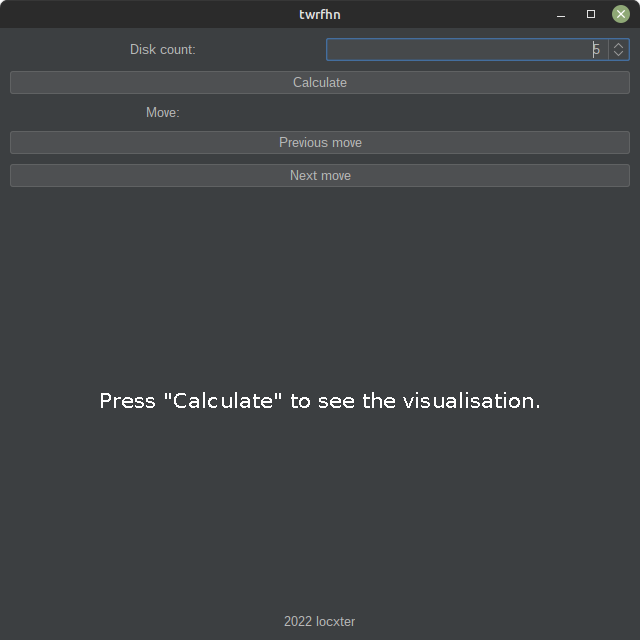

# twrfhn

## Overview

This is a visualization of the classic game Tower of Hanoi using an iterative algorithm to calculate the fastest way of solving it.

## Dependencies

I generally try to minimize dependencies, but I'm a one man crew and can therefore only support Linux Mint/Ubuntu as I'm running it myself. Anyway, you need to have the following packages installed for everything to work properly:

- JDK for developing Java programs. Install it with `sudo apt install openjdk-17-jdk`.
- Maven for building the whole thing. Install it with `sudo apt install maven`.

## How to use it

Build the JAR via `mvn clean compile assembly:single` and then run it via `java -jar target/twrfhn-1.0-jar-with-dependencies.jar`.
